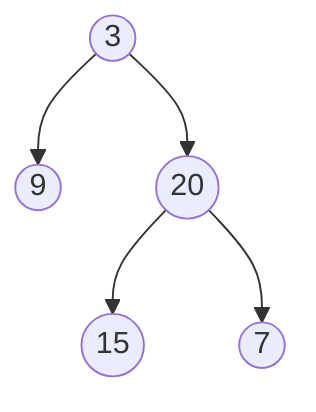
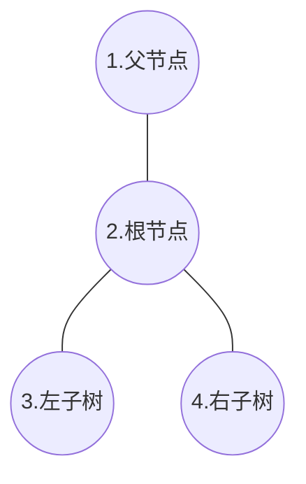

# 算法解析

----

## 树结构

### Leetcode §99 恢复二叉搜索树

https://leetcode.com/problems/recover-binary-search-tree/
https://leetcode-cn.com/problems/recover-binary-search-tree/

#### 题目描述

二叉搜索树中的两个节点被错误地交换。
请在不改变其结构的情况下，恢复这棵树。

#### 计算逻辑

首先,当我们中序遍历(in order traversal)一棵正确的二叉搜索树时,输出结果是一个单调递增的序列
那么题目中描述的节点交换等效于调换了单调递增序列中的任意两个元素
我们只需要找到这两个元素,将元素的值进行交换,即可修复二叉搜索树

具体到查找的算法,第一反应肯定是从数组的第一个元素开始,判断每个元素前后的其他元素,如果不符合单调递增的规律,说明当前元素是被调换过的
这种查找方式有两个问题:

1. 数组首尾两个边界不好处理
因为我们判断元素的状态,需要前后两个元素共同参与,边界上的元素判断条件是缺失的
2. 异常元素的相邻元素不好判断
如果我们从头向尾单向遍历,判断每个元素的状态,那么当我们遇到第一个元素异常时,该元素的后一个元素,其实也不符合我们预设的单调递增规律,但是又不能简单予以排除 --- 考虑到相邻两个元素调换的情况,后一个元素就是我们的目标对象

所以我决定从数组的两端进行遍历,从头开始遍历,发现第一个元素其值大于后一个元素值,即为我们查找的两个元素之一
然后从数组的尾部向前遍历,发现第一个元素值小于前一个元素,即为第二个目标元素
这种查找方式,可以避免前面提到的两个问题,而且编写起来也十分简单

##### 时空复杂度

时间复杂度:`O(N)` N等同于树节点的数量,计算过程中每个节点访问一次(我这里为了方便使用了数组保存中序遍历结果,所以时间复杂度`2N`,每个节点遍历两次)
空间复杂度:`O(N)` 我这里为了方便使用了数组保存中序遍历结果,所以时间复杂度`O(N)`,如果能在遍历的同时进行判断,那么空间复杂度为`O(1)`

#### 代码

`../src/Leetcode/RecoverBinarySearchTree_99.cs`

### Leetcode §100 判断二叉树是否相同

https://leetcode.com/problems/same-tree/
https://leetcode-cn.com/problems/same-tree/

#### 需求描述

给定两个二叉树,判断二叉树的结构与节点值是否相同

#### 计算逻辑

首先判断根节点值是否相等,然后递归地访问左右子树,当左右子树和根节点都一致,则认为两棵树结构与节点值都相同

##### 时空复杂度

时间复杂度:`O(N)` N等同于树的节点数量,整个计算过程中,每个节点都访问一次
空间复杂度:完全且平衡的二叉树情况下达到最优的`O(logN)`,完全不平衡二叉树情况下达到最差的`O(N)`,以函数调用栈的形式占据内存空间

#### 代码

`../src/Leetcode/SameTree_100.cs`

#### 测试用例

`../src/LeetcodeTest/SameTreeTest.cs`

1. 空二叉树与单节点二叉树
2. 结构相同的树(节点值相同或不同)
3. 结构不同的树

----

### Leetcode §106 从中序与后序遍历序列构造二叉树

https://leetcode.com/problems/construct-binary-tree-from-inorder-and-postorder-traversal/
https://leetcode-cn.com/problems/construct-binary-tree-from-inorder-and-postorder-traversal/

#### 需求描述

根据一棵树的中序遍历与后序遍历构造二叉树。
注意:可以假设树中没有重复的元素。

例如，给出

      中序遍历 inorder = [9,3,15,20,7]
      后序遍历 postorder = [9,15,7,20,3]

返回如下二叉树:

#### 计算逻辑

对于树,最为经典的计算方法当然是递归,首先寻找树的根节点,然后分别构造左右子树
所以首先可以找到后序遍历数组的最后一个值,也就是题目中的3,这就是整个子树的根节点
然后在中序遍历数组中同样找到3
以这个3为界,左半边可以用来构造左子树,右半边用于构建右子树
递归该逻辑即可构造整个二叉树

##### 时空复杂度

时空复杂度都为`O(N)`,N为全部节点数量
由于构造的过程都是基于数组,查找开销非常低,并且计算过程中除了新建树节点外没有多余内存开销,所以消耗的时间空间与新建的树节点/数组元素数量成正比

#### 代码

`../src/Leetcode/ConstructBinaryTreefromInorderandPostorderTraversal_106.cs`

#### 测试用例

`../src/LeetcodeTest/ConstructBinaryTreefromInorderandPostorderTraversalTest.cs`

1. 明显不符合预设条件的输入,比如Null或者两数组元素数量不等
2. 输入元素由于数值不同或数值相同但位置错误无法构造成二叉树
3. 分别测试两种结构的二叉树,包含左-左&左-右&右-左&右-右四种不同的递归路径

----

### Leetcode §110 平衡二叉树

https://leetcode.com/problems/balanced-binary-tree/
https://leetcode-cn.com/problems/balanced-binary-tree/

#### 需求描述

给定一个二叉树，判断它是否是高度平衡的二叉树。

本题中，一棵高度平衡二叉树定义为：

      一个二叉树每个节点 的左右两个子树的高度差的绝对值不超过1。

#### 计算逻辑

使用递归
对于每一棵子树的根节点,需要获取其左右子树是否平衡以及树的高度:

1. 如果左右子树中有任一不平衡,则计算结束,直接返回false
2. 如果左右子树皆平衡,则判断左右子树高度差是否大于1
   大于1说明当前根节点形成的子树不平衡
   小于等于1说明当前根节点的子树也是平衡的

所以我们需要定义一个递归方法,返回值为元组类型`Tuple<bool,int>`,包含子树是否平衡以及子树高度

##### 时空复杂度

时间复杂度: 无论如何,我们都需要遍历全部节点才能得知最终结果,所以时间复杂度为`O(N)`(不考虑算法短路的特殊情况)
空间复杂度: 若树尽量保持平衡,则栈空间复杂度为`O(logN)`,最坏的空间复杂度`O(N)`,即所有的内存栈空间都用于递归调用函数

#### 代码

`../src/Leetcode/BalancedBinaryTree_110.cs`

#### 测试用例

`../src/LeetcodeTest/BalancedBinaryTreeTest.cs`

1. 空节点
2. 单节点
3. 二层的二叉树(永远保持平衡)
4. 三层/四层二叉树

----

### Leetcode §124 二叉树中的最大路径和

https://leetcode.com/problems/binary-tree-maximum-path-sum
https://leetcode-cn.com/problems/binary-tree-maximum-path-sum

#### 需求概述

给定一个非空二叉树，返回其最大路径和。
本题中，路径被定义为一条从树中任意节点出发，达到任意节点的序列。该路径至少包含一个节点，且不一定经过根节点。

#### 计算逻辑

对于二叉树结构,最为直观的访问方式就是递归,用在这一题中也是十分合适的
首先就要提取出树的最小子结构,如下图所示

图中展示了一个树的最小子结构,包含了父节点,子树根节点,根节点的左右子树四个基本元素,在这个基础上讨论题目的解法

回到题目本身,题目要求计算树节点的最大路径和,对于上图展示的结构,我们所需要寻找的目标路径有以下几种可能性:

1. 目标路径**仅**存在于左子树(节点1)或右子树(节点2)内部
2. 目标路径从左/右子树出发,经过根节点(当前层级无法判断是否通向父节点:这需要通过递归返回值,在上一层程序中判断)
3. 目标从左子树出发,经过根节点,通向右子树(当然方向可以反过来,从右子树出发,但是结果是一样的)

那么答案就相当明显了,我们可以先分别计算左右子树内部最大的路径和,然后结合根节点的值判断各种可能性,并保留最大值
需要注意的是,针对**可能性2**,应当将本层级的最大路径和数值返回给上一层,让父节点判断是否使用返回值

#### 代码

`../src/Leetcode/BinaryTreeMaximumPathSum_124.cs`

#### 测试用例

`../src/LeetcodeTest/BinaryTreeMaximumPathSumTest.cs`

1. 仅包含一个节点的树:
   正数,负数,0,int类型的最大最小值
2. 目标路径限定在子树内部
3. 目标路径包括子树和根节点
4. 目标路径包括子树,根节点与父节点
5. 目标路径包括左子树,根节点,右子树

----

### Leetcode §129 计算树结构代表的数字总和

https://leetcode.com/problems/sum-root-to-leaf-numbers/

#### 需求概述

给定一个树结构,每个节点的值都限定在0-9
假设从根节点到一个叶节点,其路径上的节点数值为1->2->3,相当于数值123
现在需要计算这个树的所有根节点到叶节点的路径所代表数值之和

#### 计算逻辑与代码

##### 深度优先遍历

从树结构的根节点出发,使用递归方式向下访问子节点
递归调用时,将当前节点的值与上一层传入的值相加,并乘以10,作为下一层节点的基数
这样当访问到叶节点的时候,就可以获得从根节点开始的总数值
将所有的数值累加即可

#### 代码

`../src/Leetcode/SumRootToLeafNumbers_129.cs`

#### 测试用例

`../src/LeetcodeTest/SumRootToLeafNumbersTest.cs`

1. 根节点为Null
2. 仅包含一个节点的树
3. 包含子节点的树(二层,三层)
4. 仅包含左子节点的树
5. 不平衡的二叉树
6. 叶节点为0的树(针对自下而上的计算方法特别增加的用例,如果采用自上而下的方法,不需要此用例)

----

### Leetcode §144 前序遍历树结构

https://leetcode.com/problems/binary-tree-preorder-traversal/

#### 需求概述

给定一个树结构,其中每个节点都包含一个`Int`类型的值,以及对左右子节点的引用
要求使用前序遍历处理树结构,并用`IList<int>`类型输出结果
*前序遍历:对于一个树结构中的节点,首先访问节点本身,然后分别访问左子树和右子树*

#### 计算逻辑与代码

##### 使用递归

对于一棵树(包括子树),首先访问根节点,然后分别遍历左右节点,结果全部输出到同一个数组中,即可达到前序遍历的效果

**评价:**
正常来说看到树相关的算法,第一想到的就是递归解法
递归本身效率比较高(仅需要付出函数调用的开销即可),而且符合抽象上的逻辑
唯一需要注意的是递归的层数,极端情况下可能出现栈溢出异常

##### 使用堆栈+循环

对于一棵树(包括子树),首先访问根节点,然后将右节点和左节点分别推入栈中
然后开启循环,当栈不为空时,弹出最顶层的节点,访问其值,然后查看此节点是否有子节点,如果有子节点,继续按照先右节点后左节点的顺序入栈
循环直到栈中所有节点都弹出即可
*由于题目要求前序遍历,应当按照根节点-左子节点-右子节点的顺序处理,所以入栈的时候需要先推入右子节点,然后再推入左子节点,出栈的时候也会对应地先弹出左子节点进行处理*

**评价:**
使用堆栈的解法相比于递归解法没有那么直观,而且效率也不一定更高,但是不会出现程序栈溢出的异常
很多时候面试官会更喜欢用这种方式考察代码,主要是考察面试人思维能否快速转换

#### 代码

`../src/Leetcode/Binary_Tree_Preorder_Traversal_144.cs`

#### 测试用例

`../src/LeetcodeTest/BinaryTreePreorderTraversalTest.cs`

1. 根节点为空
2. 树结构仅包含根节点
3. 一个二层的树,包含少数几个节点(左右都有)
4. 一个三层的树,仅包含左/右子节点
5. 一个完全二叉树

----

### Leetcode §145 后序遍历树结构

https://leetcode.com/problems/binary-tree-postorder-traversal
*基本逻辑与§144一致,不需赘述*

#### 计算逻辑

##### 递归

同§144,调整添加到列表的先后顺序即可

##### 循环

从§144的例子中,循环可以用来代替递归
问题在于,后序遍历的循环,如果完全按照前序遍历的方式来做,会比较麻烦
因为我们遍历一棵子树,总是从根节点入手的:**根节点最先被访问,但是其值在最后才被加入结果,如果我们将根节点也推入堆栈,那么就需要额外标记,当下一次堆栈弹出根节点时,我们就不能将其左右子节点再次加入堆栈,否则将导致死循环**
所以,我考虑保持前序遍历的访问方式,但是按照**记录根节点数值->访问右子节点->访问左子节点**顺序(也就是正常访问顺序的镜像)处理.当我们完成遍历后,调用IList.Reverse()方法,将结果镜像,实际的访问顺序就变成了**访问左子节点->访问右子节点->记录根节点数值**,也就是后序遍历

### Leetcode §222 完全二叉树的节点个数

https://leetcode.com/problems/count-complete-tree-nodes/
https://leetcode-cn.com/problems/count-complete-tree-nodes/

#### 描述

给出一个**完全二叉树**，求出该树的节点个数

#### 计算逻辑

首先考虑最简单直观的递归计算节点总数,递归计算左右子树节点数目,加上当前根节点,作为中间结果返回上层递归
时间复杂度:$O(N)$,N为全部节点的数目,简单递归会遍历全部节点
空间复杂度:$O(logN)$,为递归计算时占据的调用栈大小

二分法:
由于本题的前提是完全二叉树,所以最高层的节点,必定是从左向右逐个填充的.所以我们可以用二分法的方式,查看每一个"可能存在的叶节点",如果该位置上为Null,说明最后一个叶节点在左半段;如果该位置上有节点,说明最后一个叶节点在右半段.
空间复杂度:$O(1)$,遍历过程中不涉及递归以及新建树结构等开销
时间复杂度:$O(log^2N)$,最高层的叶节点数量为$N/2$,二分法寻找消耗$logN$时间;从根节点到叶节点,路径长度为$logN$,每次进行二分法计算都需要完整遍历路径上的节点,综合下来时间复杂度为$O(log^2N)$

#### 代码

`../src/Leetcode/CountCompleteTreeNodes_222.cs`

#### 测试用例

`../src/LeetcodeTest/CountCompleteTreeNodesTest.cs`

1. 根节点为Null
2. 树只包含一个根节点
3. 三层树结构,并且最后一个叶节点是其父节点的左节点
4. 三层树结构,并且最后一个叶节点是其父节点的右节点
5. 三层树结构,最高一层被叶节点占满

### Leetcode §235 二叉搜索树的最近公共祖先

https://leetcode.com/problems/lowest-common-ancestor-of-a-binary-search-tree/
https://leetcode-cn.com/problems/lowest-common-ancestor-of-a-binary-search-tree/

#### 描述

给定一个**二叉搜索树**, 找到该树中两个指定节点的最近公共祖先。

#### 计算逻辑

注意题目中所给的数据结构是**二叉搜索树**,其最基本的性质是,每个节点的左子节点小于自己,而右节点大于自己
所以寻找两个节点的最近公共祖先,可以转换成另一种表述形式:找到一个节点,使得我们的目标节点p和q分别位于该节点的左右子树
所以我们可以根据当前节点的值,与pq的相对大小,来逐步逼近结果(类似于二分法)

具体过程:
从整个树的根节点开始,比对p与q的值:如果根节点值位于p与q的左侧,说明我们的目标节点位于当前节点的右子树中;反之亦然;只有当p与q分别位于节点的左右子树中,该节点即为最终结果

#### 代码

`../src/Leetcode/LowestCommonAncestorofaBinarySearchTree_235.cs`

### Leetcode §257 二叉树的所有路径

https://leetcode.com/problems/binary-tree-paths/
https://leetcode-cn.com/problems/binary-tree-paths/

#### 描述

给定一个二叉树，返回所有从根节点到叶子节点的路径。
说明: 叶子节点是指没有子节点的节点。

#### 计算逻辑

此题基本逻辑十分简单,使用深度优先遍历即可求解
但是细节方面需要注意:
一个是字符之间用`->`符号连接
另一个则是题目中特别提到了**叶子节点**,也就是说,只要一个节点拥有子节点,那么就应当继续向下递归,而不是作为一个结果添加到列表

#### 代码

`../src/Leetcode/BinaryTreePaths_257.cs`

#### 测试用例

`../src/LeetcodeTest/BinaryTreePathsTest.cs`

1. 根节点为Null的情况,返回空的List
2. 树只包含根节点一个节点
3. 正常的树(应当注意覆盖上面提到的两个要点)
